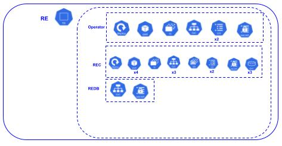

# Redis Enterprise + RDI on K8S

## Contents
1.  [Summary](#summary)
2.  [Features](#features)
3.  [Prerequisites](#prerequisites)
4.  [Installation](#installation)
5.  [Usage](#usage)
6.  [Build Explanation](#build)
    1.  [Step 1 - K8S Core](#k8s)
        1.  [AWS](#aws_build)
        2.  [Azure](#azure_build)
        3.  [GCP](#gcp_build)
        4.  [Kind](#kind_build)
    2.  [Step 2 - Redis Operator](#redis_operator)
    3.  [Step 3 - Redis Cluster](#redis_cluster)
    4.  [Step 4 - Redis Database](#redis_database)
    5.  [Step 5 - RDI](#rdi)
    6.  [Step 6 - Postgres](#postgres)
    7.  [Step 7 - Debezium](#debezium)
7.  [Results](#results)
8.  [Clean-up Explanation](#destroy)
    1.  [AWS](#aws_destroy)
    2.  [Azure](#azure_destroy)
    3.  [GCP](#gcp_destroy)
    4.  [Kind](#kind_destroy)


## Summary <a name="summary"></a>
This is an automated script for building an environment of Redis Enterprise (RE), Redis Data Integration (RDI), and Postgres SQL on various Kubernetes (K8S) platforms.

## Features <a name="features"></a>
- Builds out a full RE and RDI w/Postgres ingress environment on K8S
- BASH script that utilizes native Cloud Service Provider CLI commands and kubectl
- Supports the following K8S environments:  AWS EKS, Azure AKS, Google Cloud GKE, Kind (local)

## Prerequisites <a name="prerequisites"></a>
- kubectl
- gcloud cli
- aws eksctl
- azure cli
- kind

## Installation <a name="installation"></a>
```bash
git clone https://github.com/Redislabs-Solution-Architects/re-rdi-k8s.git && cd re-rdi-k8s
```

## Usage <a name="usage"></a>
### Options
- aws, azure, gcp, and kind currently supported.

### Execution Example
```bash
./start.sh gcp
```
```bash
./stop.sh gcp
```

## Build Explanation - Step by Step <a name="build"></a>
### Step 1 - K8S Core <a name="k8s"></a>

For all K8S environments, a 3-node cluster is built with external IP access to the RE database and the Postgres database.  LoadBalancers are utilized to expose the external IP address of both.  The Kind build is on the local hardware and control plane + worker nodes are implemented as Docker containers.  The AWS, Azure, and GCP builds yield VMs for the worker nodes.

#### Architecture
Below is a diagram of what gets built in Step 1.  

 

#### AWS <a name="aws_build"></a>
- config.yaml: ekstcl is used for the cluster build.  The config below creates a 3 worker node cluster.
```yaml
apiVersion: eksctl.io/v1alpha5
kind: ClusterConfig
metadata:
  name: ${USER}-redis-cluster
  region: us-west-2
nodeGroups:
  - name: ng-1
    instanceType: m5.4xlarge
    desiredCapacity: 3
```
---
- build.sh:  Of the four K8S platforms discussed here, AWS turns out to be most complex.  The AWS CLI is super complex.  The ekstcl script tool is intended to mask that CLI complexity; however, it has its own complexities.  eckstcl is using CloudFormation templates in the backgroud to simplify the AWS K8S build.  Most of the code below is to enable Persistent Volumes against EBS.  Even ekstcl w/CloudFormation doesn't handle this automatically.
```bash
AWS_ID=$(aws sts get-caller-identity --query "Account" --output text)
envsubst < $PWD/aws/config.yaml | eksctl create cluster -f -

eksctl utils associate-iam-oidc-provider \
    --region=us-west-2 \
    --cluster=$USER-redis-cluster \
    --approve

eksctl create iamserviceaccount \
    --name ebs-csi-controller-sa \
    --namespace kube-system \
    --cluster $USER-redis-cluster \
    --role-name AmazonEKS_EBS_CSI_DriverRole \
    --role-only \
    --attach-policy-arn arn:aws:iam::aws:policy/service-role/AmazonEBSCSIDriverPolicy \
    --approve

eksctl create addon \
    --name aws-ebs-csi-driver \
    --cluster $USER-redis-cluster \
    --service-account-role-arn arn:aws:iam::$AWS_ID:role/AmazonEKS_EBS_CSI_DriverRole \
    --force
```
#### Azure <a name="azure_build"></a>
- build.sh:  K8S build on Azure is very straightforward.  You need a Resource Group.  In that Resource Group, you build a AKS cluster and enable the credentials to be written to your local kube config.  The Azure CLI commands below perform all three functions.
```bash
az group create \
    --name $USER-redis-cluster-ResourceGroup \
    --location westus

az aks create \
    --resource-group $USER-redis-cluster-ResourceGroup \
    --name $USER-redis-cluster \
    --node-count 3 \
    --node-vm-size Standard_DS3_v2 \
    --generate-ssh-keys

az aks get-credentials \
    --resource-group $USER-redis-cluster-ResourceGroup \
    --name $USER-redis-cluster \
```
#### GCP <a name="gcp_build"></a>
--build.sh:  Google wins hands down on simplicity of K8S deployments.  The one-liner below creates the three-node K8S cluster.
```bash
gcloud container clusters create $USER-redis-cluster --num-nodes 3 --machine-type e2-standard-4
```

#### Kind <a name="kind_build"></a>
- config.yaml:  Creates a three-worker node + control plane node cluster.  Port 12000 is exposed for the Redis DB.
```yaml
kind: Cluster
apiVersion: kind.x-k8s.io/v1alpha4
nodes:
- role: control-plane
  kubeadmConfigPatches:
  - |
    kind: InitConfiguration
    nodeRegistration:
      kubeletExtraArgs:
        system-reserved: memory=2Gi
        node-labels: "ingress-ready=true"    
  extraPortMappings:   
  - containerPort: 12000
    hostPort: 12000
    protocol: TCP   
- role: worker
  kubeadmConfigPatches:
  - |
    kind: JoinConfiguration
    nodeRegistration:
      kubeletExtraArgs:
        system-reserved: memory=8Gi
- role: worker
  kubeadmConfigPatches:
  - |
    kind: JoinConfiguration
    nodeRegistration:
      kubeletExtraArgs:
        system-reserved: memory=8Gi
- role: worker
  kubeadmConfigPatches:
  - |
    kind: JoinConfiguration
    nodeRegistration:
      kubeletExtraArgs:
        system-reserved: memory=8Gi
```
---
- build.sh:  Applies the yaml above and creates a MetalLB loadbalancer.  As of this writing, Kind doesn't have a built-in loadbalancer.
```bash
echo -e "\n*** Create K8S (Kind) Cluster ***"
kind create cluster --config=$PWD/kind/config.yaml --name $USER-redis-cluster

echo -e "\n*** Create Loadbalancer ***"
kubectl apply -f https://raw.githubusercontent.com/metallb/metallb/v0.13.7/config/manifests/metallb-native.yaml; sleep 5
kubectl wait --namespace metallb-system --for=condition=ready pod --selector=app=metallb --timeout=-1s
SUBNET=`docker network inspect kind | jq '.[].IPAM.Config[0].Subnet' | cut -d . -f 1,2,3 | sed -e 's/^"//'`
ADDRESSES=${SUBNET}.10-${SUBNET}.100
cat > $PWD/kind/metallb.yaml <<EOF
apiVersion: metallb.io/v1beta1
kind: IPAddressPool
metadata:
  name: example
  namespace: metallb-system
spec:
  addresses:
  - $ADDRESSES
---
apiVersion: metallb.io/v1beta1
kind: L2Advertisement
metadata:
  name: empty
  namespace: metallb-system
EOF
kubectl apply -f $PWD/kind/metallb.yaml
```

### Step 2 - Redis Operator <a name="redis_operator"></a>

The remainder of the build steps are in generic kubectl.  The Redis Operator is deployed first to enable deployment of the rest of Redis components.

#### Architecture
Below is a diagram of what gets built in Step 2.

 

#### Code
- start.sh:  The kubectl commands below create a namespace for Redis and then set it as default for the subsequent Redis component deployments.  It then fetches the latest Redis Operator bundle, deploys it, and waits on deployment completion.
```bash
kubectl create namespace re
kubectl config set-context --current --namespace=re
RE_LATEST=`curl --silent https://api.github.com/repos/RedisLabs/redis-enterprise-k8s-docs/releases/latest | grep tag_name | awk -F'"' '{print $4}'`
kubectl apply -f https://raw.githubusercontent.com/RedisLabs/redis-enterprise-k8s-docs/$RE_LATEST/bundle.yaml; sleep 1
kubectl rollout status deployment redis-enterprise-operator
```

### Step 3 - Redis Cluster <a name="redis_cluster"></a>
A three-node Redis Enterprise Cluster (REC) is built with bash + kubectl commands.

#### Architecture
Below is a diagram of what gets built in Step 3.

 

#### Code
- rec.yaml: This is a parameterized yaml file.  envsubst is used to populate values.  Note the configuration to enable external IP access via load balancer.
```yaml
apiVersion: v1
metadata:
  name: ${REC_NAME}
data:
  password: ${REC_PWD_B64}
  username: ${REC_USER_B64}
kind: Secret
type: Opaque
---
apiVersion: "app.redislabs.com/v1"
kind: "RedisEnterpriseCluster"
metadata:
  name: ${REC_NAME}
  labels:
    app: rec
spec:
  nodes: 3
  servicesRiggerSpec:
    databaseServiceType: load_balancer
```
--- 
- start.sh
The code below does the following:
  - Sets shell vars for the default REC user (demo@redis.com) and a random password for that user.
  - Sets shell vars to the base64 encodings of the REC user and password.  Sets a shell var to the REC cluster name.
  - Executes envsubst to plug those shell vars into a rec.yaml file and then applies it via kubectl.
  - Waits for completion of the rollout of the REC stateful set.
  - Downloads the Redis Gears module to the REC pods.
  - Deploys Redis Gears to the cluster.
  - Waits for completion of the Redis Gears deployment.
```bash
REC_USER="demo@redis.com"
REC_PWD=$(apg -a 1 -m 20 -n 1 -M NCL)
echo "REC Username: $REC_USER"
echo "REC Password: $REC_PWD"
export REC_USER_B64=$(echo -n $REC_USER | base64)
export REC_PWD_B64=$(echo -n $REC_PWD | base64)
export REC_NAME=mycluster
envsubst < ./redis/rec.yaml | kubectl apply -f -; sleep 1
kubectl rollout status sts/$REC_NAME
kubectl exec -it $REC_NAME-0 -c redis-enterprise-node -- curl -s https://redismodules.s3.amazonaws.com/redisgears/redisgears_python.Linux-ubuntu18.04-x86_64.1.2.6.zip -o /tmp/redis-gears.zip
kubectl exec -it $REC_NAME-0 -c redis-enterprise-node -- curl -s -o /dev/null -k -u "$REC_USER:$REC_PWD" https://localhost:9443/v2/modules -F module=@/tmp/redis-gears.zip
while [ -z "$(kubectl exec -it $REC_NAME-0 -c redis-enterprise-node -- curl -s -k -u "$REC_USER:$REC_PWD" https://localhost:9443/v1/modules | \
jq '.[] | select(.display_name=="RedisGears").semantic_version')" ]
do  
  sleep 3
done
```

### Step 4 - Redis Database <a name="redis_database"></a>

A Redis database instance with the Search and JSON modules enabled is created.

#### Architecture
Below is a diagram of what gets built in Step 4.

 

#### Code
- redb.yaml: Parameterized yaml below.  The config creates a 1-shard DB with a predefined password and port.  Search and JSON modules are enabled for this db.
```yaml
apiVersion: v1
metadata:
  name: redis-enterprise-mydb
data:
  password: ${REDB_PWD_B64}
  username: ${REDB_USER_B64}
kind: Secret
type: Opaque
---
apiVersion: app.redislabs.com/v1alpha1
kind: RedisEnterpriseDatabase
metadata:
  name: ${REDB_NAME}
  labels:
    app: redisdb
spec:
  memorySize: 100MB
  shardCount: 1
  databasePort: ${REDB_PORT}
  databaseSecretName: redis-enterprise-mydb
  modulesList:
    - name: search
      version: ${SEARCH_VERSION}
    - name: ReJSON
      version: ${JSON_VERSION}
```
---
- start.sh: The code below does the following:
  - Sets shell vars for the REDB user (default) and a random password for that user.
  - Sets shell vars to the base64 encodings of the REDB user and password.  Sets shell vars for the REDB name and port.
  - Executes envsubst to plug those shell vars into a redb.yaml file and then applies it via kubectl.
  - Waits for completion of the load-balancer build and sets a shell var to the IP address/hostname.
```bash
export REDB_USER="default"
export REDB_PWD=$(apg -a 1 -m 20 -n 1 -M NCL)
echo "REDB Username: $REDB_USER"
echo "REDB Password: $REDB_PWD"
export REDB_USER_B64=$(echo -n $REDB_USER | base64)
export REDB_PWD_B64=$(echo -n $REDB_PWD | base64)
export REDB_NAME="mydb"
export REDB_PORT=12000
envsubst < ./redis/redb.yaml | kubectl apply -f -
REDB_HOST=""
while [ -z $REDB_HOST ]
do
  sleep 3
  REDB_HOST=$(kubectl get service $REDB_NAME-load-balancer -o jsonpath='{.status.loadBalancer.ingress[0].*}' 2>/dev/null)
done
echo "REDB Host and Port: $REDB_HOST $REDB_PORT"
```

### Step 5 - RDI <a name="rdi"></a>

Creates a pod that holds the RDI executable.

#### Architecture
Below is a diagram of what gets built in Step 5.

 
 

#### Code
- config-template.yaml:  This is parameterized config.yaml for the RDI deployment.  It gets populated from environment vars via envsubst.
```yaml
connections:
  target:
    type: redis
    host: ${REDB_NAME}-load-balancer
    port: ${REDB_PORT}
    user: ${REDB_USER}
    password: ${REDB_PWD}

applier:
  error_handling: dlq
  dlq_max_messages: 100
  target_data_type: json
```
---
- rdi-cli.yaml:  This is the K8S config for a pod that has the RDI executable in it.  I'm using this method to execute RDI commands within the K8S cluster.  Config maps for the RDI config and jobs are set up in the start.sh script.  The config below mounts those as volumes.
```yaml
apiVersion: v1
kind: Pod
metadata:
  name: rdi-cli
  labels:
    app: rdi-cli
spec:
  containers:
    - name: rdi-cli
      resources:
        requests:
          cpu: "250m"
          memory: "256Mi"
        limits:
          cpu: "250m"
          memory: "256Mi"
      image: docker.io/redislabs/redis-di-cli:latest
      volumeMounts:
      - name: config-volume
        mountPath: /app
      - name: jobs-volume
        mountPath: /app/jobs
  volumes:
    - name: config-volume
      configMap:
        name: redis-di-config
        optional: true
    - name: jobs-volume
      configMap:
        name: redis-di-jobs
        optional: true
```
---
- start.sh: The code below does the following:
  - Sets shell vars for the RDI port and password.
  - Executes envsubst to plug those shell vars into a RDI config-template file and then redirects the output of that to a file named config.yaml.
  - Creates config maps for the RDI config.yaml and jobs.
  - Deploys a K8S pod for the RDI executable.
  - Waits for the pod to be ready.
  - From the RDI pod, executes the RDI create command
  - Waits for the load balancer to be assigned an external address
  - Executes the RDI deploy command from the RDI pod.
```bash
export RDI_PORT=13000
export RDI_PWD=$(apg -a 1 -m 20 -n 1 -M NCL)
echo "RDI Password: $RDI_PWD"
envsubst < ./rdi/config-template.yaml > ./rdi/config.yaml
kubectl create configmap redis-di-config --from-file=./rdi/config.yaml
kubectl create configmap redis-di-jobs --from-file=./rdi/jobs
kubectl apply -f ./rdi/rdi-cli.yaml
kubectl wait --for=condition=ready pod --selector=app=rdi-cli --timeout=-1s
kubectl exec -it rdi-cli -- redis-di create --silent --cluster-host $REC_NAME --cluster-api-port 9443 --cluster-user $REC_USER \
--cluster-password $REC_PWD --rdi-port $RDI_PORT --rdi-password $RDI_PWD
while [ -z "$(kubectl get service redis-di-1-load-balancer -o jsonpath='{.status.loadBalancer.ingress[0].*}' 2>/dev/null)" ]
do 
  sleep 3
done
kubectl exec -it rdi-cli -- redis-di deploy --dir /app --rdi-host redis-di-1-load-balancer --rdi-port $RDI_PORT --rdi-password $RDI_PWD
```

### Step 6 - Postgres <a name="postgres"></a>

Creates a Postgres stateful set of 1 replica.

#### Architecture
Below is a diagram of what gets built in Step 6.

 

#### Code
- postgres.yaml:  The K8S config below sets up a Postgres stateful set with 1 replica.  It is parameterized.  Those values will be provided from shell vars via envsubst.  Finally, a load-balancer is configured to provide external access to Postgres.
```yaml
apiVersion: apps/v1
kind: StatefulSet
metadata:
  name: ${POSTGRES_NAME}
spec:
  serviceName: ${POSTGRES_NAME}
  replicas: 1
  selector:
    matchLabels:
      app: ${POSTGRES_NAME}
  template:
    metadata:
      labels:
       app: ${POSTGRES_NAME}
    spec:
      containers:
        - name: ${POSTGRES_NAME}
          args: ["-c", "wal_level=logical"]
          resources:
            requests:
              cpu: "250m"
              memory: "256Mi"
            limits:
              cpu: "250m"
              memory: "256Mi"
          image: postgres:latest
          ports:
            - containerPort: 5432
          env:
            - name: POSTGRES_DB
              value: ${POSTGRES_DB}
            - name: POSTGRES_USER
              value: ${POSTGRES_USER}
            - name: POSTGRES_PASSWORD
              value: ${POSTGRES_PWD}
---
apiVersion: v1
kind: Service
metadata:
  name: postgres-service
spec:  
  type: LoadBalancer
  selector:
    app: ${POSTGRES_NAME}
  ports:
  - protocol: TCP
    port: 5432
    targetPort: 5432
```
---
start.sh:  The code below does the following:
  - Creates a namespace for postgres and sets it as default
  - Sets shell vars for Postgres name, database, user and a random password
  - Executes envsubst to plug those shell vars into the file discussed above.  Kubectl apply is then executed on the output.
  - Waits for the stateful set to be ready.
  - Waits for the load balancer to be assigned an external address
  - Copies a sql command set to the postgres pod and then executes it.
```bash
kubectl create namespace postgres
kubectl config set-context --current --namespace=postgres
export POSTGRES_NAME=postgresdb
export POSTGRES_DB=Chinook
export POSTGRES_USER=postgres
export POSTGRES_PWD=$(apg -a 1 -m 20 -n 1 -M NCL)
echo "Postgres Username: $POSTGRES_USER"
echo "Postgres Password: $POSTGRES_PWD"
envsubst < ./postgres/postgres.yaml | kubectl apply -f -; sleep 1
kubectl rollout status sts/$POSTGRES_NAME
POSTGRES_IP=""
while [ -z $POSTGRES_IP ]
do
  sleep 3
  POSTGRES_IP=$(kubectl get service postgres-service -o jsonpath='{.status.loadBalancer.ingress[0].*}' 2>/dev/null)
done
echo "Postgres Host and Port: $POSTGRES_IP 5432"
kubectl cp ./postgres/chinook.sql $POSTGRES_NAME-0:/tmp/chinook.sql;
kubectl exec $POSTGRES_NAME-0 -- psql -q -U $POSTGRES_USER --d $POSTGRES_DB -f /tmp/chinook.sql > /dev/null
```

### Step 7 - Debezium <a name="debezium"></a>

Creates a pod for the Debezium CDC process.

#### Architecture
Below is a diagram of what gets built in Step 7.

  

#### Code
- application-template.properties:  This is a parameterized template for the Debezium properties.  It gets populated from shell vars via envsubst.
```bash
debezium.sink.type=redis
debezium.sink.redis.message.format=extended
debezium.sink.redis.address=redis-di-1-load-balancer:13000
debezium.sink.redis.password=${RDI_PWD}
debezium.source.connector.class=io.debezium.connector.postgresql.PostgresConnector
debezium.source.plugin.name=pgoutput
debezium.source.offset.storage=io.debezium.server.redis.RedisOffsetBackingStore
debezium.source.topic.prefix=chinook

debezium.source.database.dbname=${POSTGRES_DB}
debezium.source.database.hostname=postgres-service.postgres
debezium.source.database.port=5432
debezium.source.database.user=${POSTGRES_USER}
debezium.source.database.password=${POSTGRES_PWD}
debezium.source.offset.flush.interval.ms=1000
debezium.source.include.schema.changes=false
debezium.source.tombstones.on.delete=false
debezium.source.schema.history.internal=io.debezium.server.redis.RedisSchemaHistory
debezium.transforms=AddPrefix
debezium.transforms.AddPrefix.type=org.apache.kafka.connect.transforms.RegexRouter
debezium.transforms.AddPrefix.regex=.*
debezium.transforms.AddPrefix.replacement=data:$0

quarkus.log.min-level=TRACE
quarkus.log.level=INFO
quarkus.log.console.json=false
quarkus.http.port=8088
```
---
- debezium.yaml: This is a K8S pod config for Debezium.  It mounts a config map (containing application.properties) as a volume.
```yaml
apiVersion: v1
kind: Pod
metadata:
  name: debezium-server
  labels:
    app: debezium-server
spec:
  containers:
    - name: debezium-server
      resources:
        requests:
          cpu: "250m"
          memory: "500Mi"
        limits:
          cpu: "250m"
          memory: "500Mi"
      image: docker.io/debezium/server:latest
      volumeMounts:
      - name: config-volume
        mountPath: /debezium/conf
  volumes:
    - name: config-volume
      configMap:
        name: debezium-config
```
---
- start.sh: The code below does the following:
  - Resets the namespace to the same that RDI and RE are in.
  - Executes envsubst to plug in shell vars into the properties template and redirects output to a new file (application.properties).
  - Creates a config map of application.properties.
  - Applies the debezium.yaml file to create the pod.
  - Waits for the pod to be ready.
```bash
kubectl config set-context --current --namespace=re
envsubst < ./debezium/application-template.properties > ./debezium/application.properties
kubectl create configmap debezium-config --from-file=./debezium/application.properties
kubectl apply -f ./debezium/debezium.yaml
kubectl wait --for=condition=ready pod --selector=app=debezium-server --timeout=-1s
```

## Sample Results <a name="results"></a>
### K8S Cluster Environment (GCP)
```bash
kubectl get nodes
```
```text
NAME                                                  STATUS   ROLES    AGE   VERSION
gke-joeywhelan-redis-clu-default-pool-0c5054fd-0k53   Ready    <none>   14m   v1.27.2-gke.1200
gke-joeywhelan-redis-clu-default-pool-0c5054fd-2s06   Ready    <none>   14m   v1.27.2-gke.1200
gke-joeywhelan-redis-clu-default-pool-0c5054fd-6l9s   Ready    <none>   14m   v1.27.2-gke.1200
```

### RE + RDI K8S Environment
```bash
kubectl -n re get all
```
```text
NAME                                             READY   STATUS    RESTARTS   AGE
pod/debezium-server                              1/1     Running   0          5m48s
pod/mycluster-0                                  2/2     Running   0          14m
pod/mycluster-1                                  2/2     Running   0          12m
pod/mycluster-2                                  2/2     Running   0          10m
pod/mycluster-services-rigger-757d7b46c5-hl265   1/1     Running   0          14m
pod/rdi-cli                                      1/1     Running   0          7m40s
pod/redis-enterprise-operator-5db5c6888d-m6c2v   2/2     Running   0          14m

NAME                               TYPE           CLUSTER-IP     EXTERNAL-IP     PORT(S)             AGE
service/admission                  ClusterIP      10.16.11.137   <none>          443/TCP             14m
service/mycluster                  ClusterIP      10.16.2.82     <none>          9443/TCP,8001/TCP   14m
service/mycluster-prom             ClusterIP      None           <none>          8070/TCP            14m
service/mycluster-ui               ClusterIP      10.16.8.220    <none>          8443/TCP            14m
service/mydb-load-balancer         LoadBalancer   10.16.6.139    34.125.97.205   12000:30636/TCP     8m23s
service/redis-di-1-load-balancer   LoadBalancer   10.16.11.177   34.125.107.70   13000:32146/TCP     7m24s

NAME                                        READY   UP-TO-DATE   AVAILABLE   AGE
deployment.apps/mycluster-services-rigger   1/1     1            1           14m
deployment.apps/redis-enterprise-operator   1/1     1            1           14m

NAME                                                   DESIRED   CURRENT   READY   AGE
replicaset.apps/mycluster-services-rigger-757d7b46c5   1         1         1       14m
replicaset.apps/redis-enterprise-operator-5db5c6888d   1         1         1       14m

NAME                         READY   AGE
statefulset.apps/mycluster   3/3     14m

```

### Postgres Schema
```bash
kubectl -n postgres exec postgresdb-0 -- psql -U postgres --d Chinook -c '\dt+'
```
```text
                                          List of relations
 Schema |      Name      | Type  |  Owner   | Persistence | Access method |    Size    | Description 
--------+----------------+-------+----------+-------------+---------------+------------+-------------
 public | actor          | table | postgres | permanent   | heap          | 40 kB      | 
 public | album          | table | postgres | permanent   | heap          | 48 kB      | 
 public | artist         | table | postgres | permanent   | heap          | 40 kB      | 
 public | category       | table | postgres | permanent   | heap          | 8192 bytes | 
 public | customer       | table | postgres | permanent   | heap          | 40 kB      | 
 public | employee       | table | postgres | permanent   | heap          | 8192 bytes | 
 public | film           | table | postgres | permanent   | heap          | 456 kB     | 
 public | film_actor     | table | postgres | permanent   | heap          | 272 kB     | 
 public | film_category  | table | postgres | permanent   | heap          | 72 kB      | 
 public | genre          | table | postgres | permanent   | heap          | 8192 bytes | 
 public | invoice        | table | postgres | permanent   | heap          | 72 kB      | 
 public | invoice_line   | table | postgres | permanent   | heap          | 152 kB     | 
 public | media_type     | table | postgres | permanent   | heap          | 8192 bytes | 
 public | org            | table | postgres | permanent   | heap          | 8192 bytes | 
 public | playlist       | table | postgres | permanent   | heap          | 8192 bytes | 
 public | playlist_track | table | postgres | permanent   | heap          | 344 kB     | 
 public | track          | table | postgres | permanent   | heap          | 392 kB     | 
(17 rows)
```
### RDI Status
```bash
kubectl -n re exec -it rdi-cli -- redis-di status --rdi-host redis-di-1-load-balancer --rdi-port 13000 --rdi-password x
```
```text
Status of Redis Data Integration version 0.101.3 on redis-di-1-load-balancer:13000

started

Engine State
Sync mode: initial snapshot
Last data retrieved (source): 07/31/2023 15:13:36.000000 
Last data updated (target): 07/31/2023 15:13:36.712621 
Last snapshot:
  Number of processes: 4
  Start: 07/31/2023 15:13:29.158840 
  End: 07/31/2023 15:13:28.419886 

Connections
+--------+-------+--------------------+-------+----------+---------+----------+-----------+
| Name   | Type  | Host(s)            | Port  | Database | User    | Password | Status    |
+--------+-------+--------------------+-------+----------+---------+----------+-----------+
| target | redis | mydb-load-balancer | 12000 |          | default | ******   | connected |
+--------+-------+--------------------+-------+----------+---------+----------+-----------+

Clients
+------------+------------------+---------------------+-----------+------------+---------+
| ID         | ADDR             | Name                | Age (sec) | Idle (sec) | User    |
+------------+------------------+---------------------+-----------+------------+---------+
| 290002001  | 10.12.0.16:58474 | debezium:redis:sink | 492       | 452        | default |
| 303002002  | 10.12.0.16:39756 | debezium:offsets    | 485       | 452        | default |
| 1248002002 | 10.12.0.15:42668 | redis-di-cli        | 0         | 0          | default |
+------------+------------------+---------------------+-----------+------------+---------+

Ingested Data Streams
+------------------------------------+-------+---------+----------+---------+---------+----------+----------+
| Name                               | Total | Pending | Inserted | Updated | Deleted | Filtered | Rejected |
+------------------------------------+-------+---------+----------+---------+---------+----------+----------+
| data:chinook.public.artist         | 275   | 0       | 275      | 0       | 0       | 0        | 0        |
| data:chinook.public.customer       | 59    | 0       | 59       | 0       | 0       | 0        | 0        |
| data:chinook.public.invoice        | 412   | 0       | 357      | 0       | 0       | 55       | 0        |
| data:chinook.public.category       | 16    | 0       | 16       | 0       | 0       | 0        | 0        |
| data:chinook.public.film           | 1000  | 0       | 1000     | 0       | 0       | 0        | 0        |
| data:chinook.public.invoice_line   | 2240  | 0       | 2240     | 0       | 0       | 0        | 0        |
| data:chinook.public.org            | 2     | 0       | 2        | 0       | 0       | 0        | 0        |
| data:chinook.public.actor          | 203   | 0       | 203      | 0       | 0       | 0        | 0        |
| data:chinook.public.playlist       | 18    | 0       | 18       | 0       | 0       | 0        | 0        |
| data:chinook.public.film_category  | 1000  | 0       | 1000     | 0       | 0       | 0        | 0        |
| data:chinook.public.media_type     | 5     | 0       | 5        | 0       | 0       | 0        | 0        |
| data:chinook.public.film_actor     | 5462  | 0       | 5462     | 0       | 0       | 0        | 0        |
| data:chinook.public.track          | 3503  | 0       | 3503     | 0       | 0       | 0        | 0        |
| data:chinook.public.album          | 347   | 0       | 347      | 0       | 0       | 0        | 0        |
| data:chinook.public.genre          | 25    | 0       | 25       | 0       | 0       | 0        | 0        |
| data:chinook.public.employee       | 8     | 0       | 8        | 0       | 0       | 0        | 0        |
| data:chinook.public.playlist_track | 8715  | 0       | 8715     | 0       | 0       | 0        | 0        |
+------------------------------------+-------+---------+----------+---------+---------+----------+----------+

Offsets
 ["redis",{"server":"chinook"}]: {"last_snapshot_record":true,"lsn":35413424,"txId":16439,"ts_usec":1690816388899156,"snapshot":true}

Performance Statistics per Batch (batch size: 2000)
  Last run(s) duration (ms): [94]
  Average run duration (ms): 204.66
```


## Clean-up Explanation
### AWS <a name="aws-destroy"></a>
Cleaning up an AWS K8S deployment turns out to be as messy as creating one.  eksctl doesn't clean up after itself very well.  In particular, if you have any external IP addresses that were allocated for the K8S cluster - you need to manually delete the objects those addresses are associated with.  In this scenario - load balancers were created for each Redis DB.  So, the Redis DBs need to be deleted to trigger deletion of their associated load balancers.  Similarly, the Postgres pod + load balancer needs to be deleted.  Following the external IP clean up, you can use eksctl to delete the remainder items created during build.

- aws/destroy.sh:  The code below performs the following:
  - deletes all Redis database instances
  - deletes the RE cluster, rdi + debezium pods and the entire postgres namespace
  - via eksctl, deletes the IAM account used to create the EBS controller and the EKS cluster.

```bash
DBS=$(kubectl -n re get redb -o jsonpath='{.items[*].metadata.name}' 2>/dev/null)
for db in $DBS
do
	kubectl delete redb $db
done

kubectl -n re delete rec mycluster
kubectl -n re delete pod rdi-cli
kubectl -n re delete pod debezium-server
kubectl delete namespace postgres

eksctl delete iamserviceaccount \
    --name ebs-csi-controller-sa \
    --namespace kube-system \
    --cluster $USER-redis-cluster 
eksctl delete cluster \
    --name $USER-redis-cluster \
    --region us-west-2 \
    --disable-nodegroup-eviction
```

### Azure <a name="azure-destroy"></a>
- azure/destoy.sh:  Just two commands to delete the entire K8S environment that was built prior:  delete the cluster and delete the resource group.
```bash
az aks delete \
    --name $USER-redis-cluster \
    --resource-group $USER-redis-cluster-ResourceGroup \
    --yes \

az group delete \
    --name $USER-redis-cluster-ResourceGroup \
    --yes \
```

### GCP <a name="gcp-destroy"></a>
- gcp/destroy.sh:  Similar to the GCP K8S build, deletion is super simple.
```bash
gcloud container clusters delete  $USER-redis-cluster --quiet
```

### Kind <a name="kind-destroy"></a>
- kind/destroy.sh:  One-liner to delete the Kind environment.
```bash
kind delete cluster --name $USER-redis-cluster
```